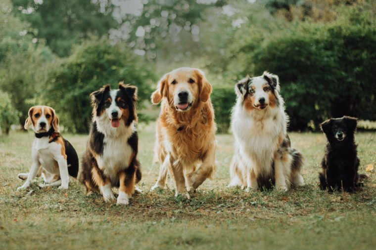

# Dog Breeds Classification with CNN and Transfer Learning

Author: TeYang, Lau  
Last Updated: 7 June 2020

### **Please refer to this [notebook](https://www.kaggle.com/teyang/dog-breeds-classification-using-transfer-learning?scriptVersionId=35621180) on Kaggle for a more detailed description, analysis and insights of the project.** 

## **Project Motivation** 
This is my first deep learning project after taking a course about it. I chose a dataset that has much diveristy yet simple for a first dive into the world of neural networks. Instead of using the common cats or dogs dataset, I chose this as there are multiple classifications/dog breeds, making it a bit more challenging than binary classification.

## **Project Goals** 
1. To build a deep learning model to **classify** pictures of 120 different dog breeds
2. Use data augmentation to generate more diversity in the pictures

## **Project Overview** 

## **About this dataset** 
This [Stanford Dog Dataset](http://vision.stanford.edu/aditya86/ImageNetDogs/) is shared by courtesy of Stanford. It contains 20580 pictures of dogds consisting of 120 different breeds. For this analysis, I only limit my train, validation and test sets to only 4000 images. After splitting, only 2560 images were used for training, and the rest split between validation and testing. The reason was because of lack of hardware memory to store such a large array of images. On hindsight and after learning more about dealing with large datasets, there is actually a way to get around this problem which involves only loading the data when it is needed for training.

## **Dog Breeds Samples** 
Here are some sample pictures of the dogs and their associated breeds. Notice that some pictures include humans while in others, the dog may be quite small. This adds to the difficulty but if the model is trained correctly, it should be able to correctly classify these images, which are usually quite prevalent in the real world.

## **Data Augmentation** 
I performed data augmentation by transforming the pictures (rotation, flipping, horizontal and vertical shifting) to produce more diversity in the dataset. 

## **Model Architecture** 
I made use of the power of transfer learning to pretrain the model. As these were already pre-trained, we can use the first layers of weights and add a few additional layers to classify the images into 120 categories. For this project, I used Google's Inception V3 model.

## **Model Training Performance** 
I tuned a few hyperparameters of the model such as the learning rate, mini-batch size and algorithm used. From the plot below, we can see that the training is still slightly underfitting but is starting to converge at 20 epochs.

## **Model Predictions** 
Our model achieved an accuracy of **~86%-88%** and this is not bad considering that we trained it on only 2650 images. Below are samples of the predictions as well as the probability of its predictions.

## **Conclusions** 

## **Difficulties Faced** 

